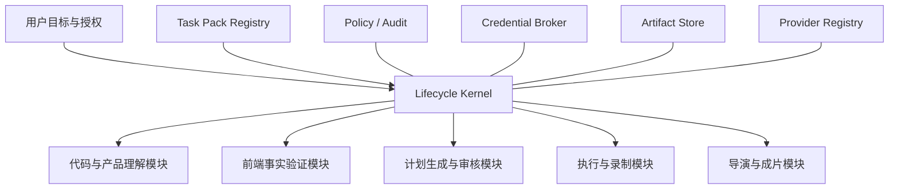

# DemoOps 模块化工作流重构方案 v1

> 状态：目标设计与增量迁移方案
> 策略：绞杀式迁移，持续保持现有主线可运行

## 1. 目标与非目标

目标是把固定 `CascadeFlow` 改造为由 Task Pack 选择、由声明式 DAG 组合、可独立暂停/恢复/替换的模块运行系统。模块只读输入 Artifact、发布新 Artifact 和 Gate Decision，不直接修改全局工作流对象。

本阶段不重写 Code Reader、Browser Runtime、Direct Transport、Editor 或 FinalFilm 的成熟算法；先通过 Adapter 接入统一生命周期端口。不改变现有 SHA-256 算法，不恢复 Aleph2，也不恢复暂停的 2048 实验。

## 2. 目标结构



Lifecycle Kernel 只负责：

- 加载 Workflow Template、解析 DAG 和能力依赖；
- 创建 Module Run、执行统一状态转换；
- 调用 Gate、预算、授权和恢复策略；
- 保存事件、Checkpoint 和 Artifact 索引；
- 向 UI 投影权威 read model。

内核禁止理解 hostname、具体产品名、业务文案、路由或 selector。

## 3. 五个业务模块

### 3.1 代码与产品理解 `source-intelligence`

输入：用户需求、代码源引用、受限项目目录、已有 Evidence。
输出：Requirement Brief、Code/Page Snapshot、Project Intelligence、Source Binding、证据缺口。
复用：Code Reader、Project Intelligence、EvidenceRef 和现有读取预算。
边界：不执行客户代码、不读取 secret 文件、不直接制定浏览器动作。

### 3.2 前端事实验证 `surface-validation`

输入：产品 URL、允许范围、语义目标、可选代码证据、凭据 ref。
输出：页面 Observation、Interaction Contract、状态指纹、结果观察能力、验证缺口。
复用：Page Reader、Page Interaction Verifier、Browser visual observer、Outcome Observer。
边界：只报告页面事实和允许动作，不定义新的业务目标。

### 3.3 计划生成与审核 `plan-review`

输入：需求、Project Intelligence、页面事实、Task Pack 约束。
输出：Workflow Graph、Stage Plan、Executable Bundle、Gate Decision 和审批主题。
复用：Business Stage Planner、Graph Builder、Script Packager、package confidence。
边界：计划不能扩大前序证据、凭据 scope 或 Task Pack 风险策略。

### 3.4 执行与录制 `execution-capture`

输入：已批准 Bundle、授权、凭据 ref、Execution Policy、预算。
输出：Stage Events、Checkpoint、Step Results、事实录制、Trace、Recording Result。
复用：Browser Worker JSON-RPC、Stage Orchestrator、Direct Gateway、Outcome Verifier、Artifact 校验。
边界：不改业务语义；once-effect 状态不确定时只观察或请求输入。

### 3.5 导演与成片 `director-media`

输入：已验证事实轨、Asset Catalog、用户导演要求、Provider 授权与预算。
输出：Evidence Digest、Director Plan、候选质量报告、EDL、Final Film、Review Package。
复用：FinalFilm CAS Store、H3/Seedance Adapter、FFmpeg Renderer、Director Skills。
边界：生成镜头只能包装事实；不得虚构 UI、替代业务结果或读取 D4。

## 4. 横切服务

| 服务 | 责任 | 禁止事项 |
| --- | --- | --- |
| Policy/Audit | Gate 目录、数据策略、风险和事件 | 不执行业务模块逻辑 |
| Credential Broker | opaque ref、短期 scope、销毁 | 不向 Artifact/事件返回 secret |
| Artifact Store | 有界路径、descriptor、留存、交付 | 不推导业务完成状态 |
| Provider Registry | 模型能力、预算、attempt、外部 task 恢复 | 不绕过 Director/质量 Gate |

## 5. Task Pack

Task Pack 是版本化 Workflow Template 加任务约束，不是站点脚本。路由器输入只允许用户目标、已验证交互结构、Feature Capability、Interaction Surface、风险和所需结果类型。

| Task Pack | 结构信号 | 典型 DAG | 关键结果 |
| --- | --- | --- | --- |
| `async-builder` | 提交、长时进度、终态结果 | source → surface → plan → execute → director | 计划执行一次、进度可恢复、终态可证明 |
| `crud-form` | 字段变更、提交、实体结果 | source? → surface → plan → execute → director | 输入原样、提交后新状态 |
| `dashboard-analytics` | 观察为主、筛选、数据区域 | surface → plan → execute → director | 数据/图表区域和筛选状态 |
| `canvas-editor` | 多次直接操作、视觉结果 | source? → surface → plan → execute → director | 画布区域变化、撤销/保存状态 |
| `interactive-application` | 键鼠输入、持续状态区域 | surface → plan → execute → director | 交互区域聚焦、输入后视觉状态变化 |

`source?` 表示代码理解是可选节点；是否启用由证据需求决定。无法拉开 Task Pack 评分时使用 `generic-goal-driven`，不得根据 hostname 猜测。

每个 Task Pack 必须声明：

- module DAG 与输入/输出 role；
- 必需 Evidence 和允许的降级；
- action risk、replay policy 和人审要求；
- 默认超时、轮询节奏和事件采样；
- 失败回退和可接受的事实轨基线；
- 跨站扰动测试集合。

## 6. Artifact 驱动的数据流

模块输出不可原地修改。每个输出使用 Artifact Descriptor 绑定 module run、版本、数据等级、role、revision 和来源。

示例：

```text
requirement-brief:r3
  + project-intelligence:r2
  + surface-evidence:r5
      -> workflow-plan:r1
      -> approved-bundle:r1
      -> recording-result:r1
      -> director-plan:r1
      -> review-package:r1
```

上游 Artifact revision 变化时，内核按依赖图将下游标记为 `inputs_changed`，只重跑受影响模块。已验证且输入未变的模块通过 Checkpoint 恢复。

## 7. UI Read Model

前端不再根据多个字段推导下一步。Lifecycle Kernel 输出统一视图：

- workflow state 和当前 module/phase；
- active Gate Decision、owner、阻断原因和下一操作；
- 已完成模块和可复用 Checkpoint；
- Artifact readiness 和缺失的 required role；
- Provider 预算、attempt 和外部等待状态；
- 最终终审 revision。

旧 `ProjectWorkspaceView` 先通过 Adapter 从统一 read model 映射，稳定后删除前端重复状态推导。

## 8. 迁移顺序

### M0：冻结规范与实验隔离

- 保存暂停实验到独立 WIP 分支。
- 冻结执行端口 v1、数据规范和 Task Pack 命名。
- 为现有成功链路保存输入/输出契约 fixture。

### M1：Lifecycle Kernel 与 Legacy Adapter

- 新增 Module Manifest、Module Run、Gate、Event 和 Artifact 索引。
- 用 Adapter 包装现有 `CascadeFlow`，行为保持不变。
- UI 以 shadow 模式展示统一 read model，与旧状态并排比对。

### M2：包装现成边界

- FinalFilm 接入 `director-media` Port。
- Browser Worker 接入本地 JSON-RPC Port。
- Direct Gateway/Worker 接入远端 HTTP/SSE Port。
- 三者运行同一生命周期一致性测试。

### M3：拆分理解与计划输出

- 将 Code Reader、Surface Validation、Graph/Script Packaging 输出改为版本化 Artifact。
- `CascadeState` 只保留兼容引用，不再内嵌大型结果。
- 审批绑定 Workflow Plan revision 和 Gate，不绑定 UI 临时状态。

### M4：启用 Task Pack DAG

- 五类 Task Pack 先 shadow 编译，再对低风险内部任务启用。
- 旧固定链作为 `legacy-cascade-flow-v1` 模板保留。
- 对同一输入比较事实步骤、授权、Artifact 和最终结果。

### M5：切换和清理

- 达到等价门槛后，默认路由切到 Task Pack。
- 删除 App/前端重复生命周期推导和站点专用内核分支。
- 将 `CascadeFlow` 降级为兼容 Adapter，最终按遥测决定移除时间。

## 9. 验收门槛

- 任一模块可独立启动、取消、等待、恢复并解释当前 Gate。
- Worker 重启、重复请求和凭据重传不重复 once-effect 或 Provider 计费。
- 事件正文不超过 512 KiB，大型证据全部引用 Artifact。
- 五类 Task Pack 在 hostname、路由、文案、DOM 层级和 iframe/canvas 组合变化下保持相同选择。
- 通用内核静态扫描不得出现产品域名、具体游戏名、固定项目路由或站点 selector。
- 旧链与新 Adapter 的 required facts、结果状态和必需 Artifact 一致。
- 用户始终能看到：正在执行什么、等待什么、哪个 Gate 阻断、谁负责、下一操作是什么。
