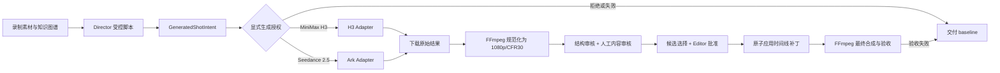

# FinalFilm：H3 / Seedance 2.5 / FFmpeg 三段式框架

## 目标与边界

最终成片由三种能力协作完成：

1. MiniMax H3 生成表现力较强的展示候选，可使用首帧或一般图片/视频参考。
2. Seedance 2.5 通过火山方舟官方异步任务接口生成另一类展示候选，适合多模态参考和镜头衔接。
3. FFmpeg 不做语义创作，只负责下载后的统一规格、确定性时间线合成、音频处理和输出验收。

生成镜头永远是非事实轨候选。它不能替换服务端录制的真实 UI、不能改变事实步骤顺序，也不能在没有人工内容审核与 Editor 批准时进入时间线。任一生成阶段失败都回退到已经渲染成功的事实轨 baseline。

## 工作流



## Provider 分工

| 组件 | 当前职责 | 不允许承担的职责 |
| --- | --- | --- |
| MiniMax H3 | 4–15 秒展示镜头；一般引用、首帧/首尾帧模式；显式价格上限与 admission | 事实步骤、真实 UI 替换、最终拼接 |
| Seedance 2.5 | 方舟 `contents/generations/tasks` 异步生成；一般图片/视频引用；固定官方模型 ID | App 自定义模型、未经审核的原生音频、自动回退调用 |
| FFmpeg | 下载后转码、CFR、尺寸/像素格式统一、拼接、混音、响度及最终探测 | 补写业务事实、决定候选内容是否可信 |

H3 与 Seedance 2.5 是并列 Provider，不形成“一个失败自动调用另一个”的隐性费用链。用户可在一次已授权的 FinalFilm 作业中明确选择其一；比较模式需要分别授权并保留两个 Provider 的任务 ID、原始文件和规范化文件。

## Seedance 2.5 官方请求合同

当前合同来自 2026-08-18 提供的最新方舟官方示例：

- endpoint：`POST /api/v3/contents/generations/tasks`
- model：`doubao-seedance-2-5-260628`
- 文本：`content[].type=text`
- 图片参考：`type=image_url`，`role=reference_image`
- 视频参考：`type=video_url`，`role=reference_video`
- 音频参考：官方支持 `type=audio_url`，`role=reference_audio`
- 异步查询：复用 Ark task client，根据任务 ID 轮询并提取 HTTPS 视频地址

产品第一版采用更窄的安全 Profile：16:9、4–15 秒、最多 4 个一般引用、`generate_audio=false`、`watermark=false`。官方示例没有设置 `resolution`，因此编译器也不臆造该字段。音频参考和模型生成音频先关闭，等人工音频内容审核、响度与峰值门禁补齐后再发布新 Profile 版本。

## 代码结构

```text
backend/internal/media/
  generated_shot_profiles.go       # H3 / Seedance 2.5 版本化能力与请求编译
  generated_shot_provider.go       # Provider-neutral 执行接口和注册表
  minimax_h3_provider_adapter.go    # H3 出站、admission、下载、规范化
  seedance_provider_adapter.go      # Ark transport 共享内核与 2.0/2.5 版本包装
  ark_client.go                     # 方舟异步 create/query client
  generated_shot_candidate.go      # Provider-neutral 候选合同
  generated_shot_review.go         # 结构与人工内容审核
  generated_shot_selection.go      # 选择记录，不等于 Editor 批准

backend/internal/app/
  final_film_providers.go           # 同时注册 H3 与 Seedance 2.5
  final_film_service.go             # 状态机、授权、幂等和审计

backend/internal/editor/
  ffmpeg_renderer.go                # baseline、最终合成和 ffprobe 验收

frontend/web/src/
  FinalFilmPanel.tsx                # Provider 明选、人工审核、Editor 批准
```

## 现有代码复用评估

| 能力 | 复用程度 | 处理方式 |
| --- | ---: | --- |
| H3 client、价格上限、并发 admission | 100% | 保持现有实现 |
| Ark create/query transport | 100% | Seedance 2.5 复用，不复制 HTTP 客户端 |
| 下载、SHA-256、FFmpeg 规范化 | 100% | 两个 Provider 使用同一接口 |
| 候选、结构审核、人工审核、选择、Editor approval | 100% | 仅把受支持 Provider 集合扩展到 2.5 |
| FinalFilm 状态机、baseline 回退、原子补丁 | 100% | 保持 Provider-neutral |
| Seedance 请求编译 | 约 70% | 新建 2.5 Profile，固定模型与 reference role |
| 前端控制面板 | 约 90% | Provider 枚举从 2.0 升级到 2.5 |

Seedance 2.0 类型与 Adapter 只为读取历史持久化作业保留，不再注册为新的 FinalFilm Provider。

## 配置和授权

```dotenv
CASCADE_VIDEO_PROVIDER=minimax-h3
CASCADE_VIDEO_MODEL=minimax-h3

SEEDANCE_BASE_URL=https://ark.cn-beijing.volces.com/api/v3
SEEDANCE_MODEL=doubao-seedance-2-5-260628
CASCADE_ARK_MEDIA_MODE=real
CASCADE_SEEDANCE_FINAL_FILM_ENABLED=true
```

`SEEDANCE_API_KEY` 只从 `.env`/进程环境读取，不能出现在请求日志、审计事件或 Git 中。配置密钥并不代表生成授权；每个作业仍需持久化的 `generation_authorized` 和 `authorization_ref`。H3 的价格预算门禁继续独立生效；Seedance 2.5 当前通过时长上限、引用上限、显式作业授权和独立 feature flag 控制使用量，待官方计费维度确认后再增加硬价格门禁。

## 验收标准

1. Registry 同时返回 `minimax-h3` 与 `seedance-2.5`，二者启用条件互不排斥。
2. Seedance 编译结果固定为 `doubao-seedance-2-5-260628`，App 不能覆盖。
3. 图片/视频引用带官方 role，未发布的音频路径会在出站前拒绝。
4. 没有持久化授权时 Provider client 调用次数必须为零。
5. Provider 原始输出和 FFmpeg 规范化输出路径、摘要必须不同。
6. 规范化候选必须为 MP4/H.264/yuv420p/1920×1080/CFR30。
7. 生成失败、审核拒绝或最终验收失败时，作业以 baseline 安全收敛。
8. 真实 API smoke test 只能通过显式环境开关执行，并保留任务 ID 与非敏感诊断。
