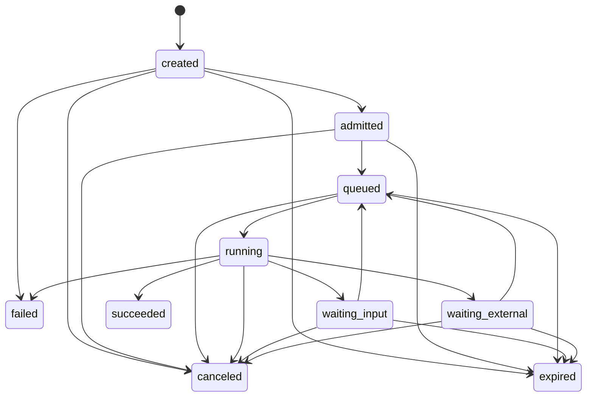

# DemoOps 通用执行端口协议 v1

> 协议标识：`demoops.execution_port.v1`
> 状态：目标协议
> 传输：Go 进程内、JSON-RPC/stdio、HTTP/SSE 语义一致

## 1. 规范关键词

本文中的“必须”“不得”“应当”和“可以”具有规范含义。协议对象的机器校验定义位于 `contracts/execution-port/v1/`；文档与 Schema 冲突时，以同版本 Schema 和本文件的安全约束中更严格者为准。

## 2. 端口能力

| 操作 | 作用 | 是否改变状态 |
| --- | --- | --- |
| `DescribeCapabilities` | 返回 Module Manifest、版本和传输能力 | 否 |
| `ValidateRequest` | 校验 schema、输入 role、策略、预算和依赖 | 否 |
| `StartRun` | 以幂等键创建或返回既有 Module Run | 是 |
| `GetRun` | 获取权威状态、phase、Gate 和 checkpoint | 否 |
| `WatchEvents` | 从指定 sequence 持续读取事件 | 否 |
| `ProvideInput` | 提供授权 ref、凭据 ref 或用户决定 | 是 |
| `ResumeRun` | 从 checkpoint 或外部 task 恢复 | 是 |
| `CancelRun` | 请求有界取消；不表示 Artifact 已删除 | 是 |
| `ListArtifacts` | 列出当前 run 发布的 Artifact Descriptor | 否 |
| `Health` | 检查端口、依赖和版本 | 否 |

`StartRun`、`ProvideInput`、`ResumeRun` 和 `CancelRun` 必须支持幂等请求。相同 idempotency key 和相同规范化请求返回同一结果；相同 key 但不同请求必须返回冲突。

## 3. 标识与上下文

所有改变状态的请求必须包含：

- `schema_version`、`request_id`、`idempotency_key`；
- `workflow_id`、`workflow_template_id`；
- `module_id`、`module_version`、`attempt`；
- `capability` 和输入 Artifact refs；
- `policy_ref`、授权 refs、预算和 deadline；
- trace/correlation context。

凭据只能以 authorization/credential ref 传递。协议对象使用 `additionalProperties: false`，防止调用方将临时 secret 或未审计字段塞入事件。

## 4. 状态机

顶层状态只有：

- `created`：记录已建立，尚未通过 Admission Gate。
- `admitted`：输入、策略、能力和预算已通过。
- `queued`：可执行，等待调度。
- `running`：模块正在执行本地或外部工作。
- `waiting_input`：需要用户、授权或凭据输入。
- `waiting_external`：外部 Provider、浏览器页面或依赖尚未终态。
- `succeeded`：模块合同已满足并发布所有 required outputs。
- `failed`：不可在原 run 内继续，包含结构化错误与责任方。
- `canceled`：取消已确认；保留策略另行执行。
- `expired`：deadline、授权或等待窗口过期。

业务细节必须放在 `phase`，不得新增 `awaiting_credentials`、`render_completed` 等顶层状态。终态为 `succeeded | failed | canceled | expired`。

## 5. Module Manifest 和 Workflow Template

Module Manifest 声明：

- module ID/version、capability；
- 输入/输出 Artifact role 和允许的数据等级；
- transport、风险类、所需权限；
- 支持的 replay policy；
- 默认资源和事件大小上限。

Workflow Template 声明 Task Pack、模块 DAG、Gate、预算和失败回退。模块选择不得使用 hostname、固定路由、selector 或产品名。DAG 必须无环，所有依赖和 Artifact role 在启动前解析完成。

## 6. 恢复与重放

动作恢复策略：

| 策略 | 可做的事 | 禁止事项 |
| --- | --- | --- |
| `observe_only` | 重新观察页面、外部任务或 Artifact | 产生业务副作用 |
| `idempotent_write` | 使用相同幂等键重发，或查询已有结果 | 生成新幂等键规避既有状态 |
| `once_effect` | 先检查 checkpoint、页面结果或外部 task ID | 状态不确定时再次创建、提交、计费或发布 |

Checkpoint 必须至少绑定 module run/attempt、已验证 phase、状态指纹、外部 task IDs、Artifact refs、once-effect 记录和创建时间。

恢复流程：

1. 校验 Workflow/Module version、输入 Artifact revision 和 policy 未变化。
2. 恢复最近 checkpoint，重新观察其 required outcomes。
3. 已确认的阶段直接跳过并发布 `checkpoint_restored` 事件。
4. `once_effect` 结果无法确认时进入 `waiting_input`，Gate owner 为 `user` 或 `operator`。
5. Provider 已有 external task ID 时只允许 resume/poll，不得创建新任务。

## 7. Gate Decision

`GateDecision` 使用 `pass | warn | block | defer`。`block` 表示当前请求违反约束；`defer` 表示合法等待，不得被转写为失败。

端口在每次状态变化前评估相关 Gate，并将 `gate_decision_ref` 写入 Execution Event。UI 只消费 Gate 的 owner、reason、remediation 和 next operation，不解析自由文本错误来猜测下一步。

## 8. 事件协议

Execution Event 必须包含：

- event ID、workflow/module run、严格递增 sequence；
- event type、发生时间；
- state before/after、phase、progress；
- Gate、Checkpoint、Artifact 和 evidence refs；
- 可选结构化 error。

允许的核心事件包括：准入、状态变化、阶段变化、Gate 判定、Checkpoint 保存、Artifact 发布、Provider 调用准入/完成、输入请求、warning 和四类终态事件。

规则：

- 单事件规范化 JSON 最大 64 KiB。
- 大型截图、DOM、Trace、模型响应和媒体必须使用 Artifact refs。
- 高频轮询只记录首次、状态变化、末次和异常摘要，不记录每次候选集合。
- `WatchEvents(after_sequence)` 必须保证不丢失已持久化事件；重连允许重复读取，调用方按 event ID 去重。

## 9. Artifact

Artifact Descriptor 必须声明：

- artifact ID、logical role、media type、data class、purpose；
- 产生它的 module run、revision 和可选外部 task ID；
- storage scope、URI、大小和是否 required；
- sensitivity、retention 和删除策略；
- 跨信任边界时的 SHA-256 digest。

D4 不得表示为 Artifact。`local_path` 不得跨远端协议传递；使用受管 URI，由对应 Adapter 映射到有界本地路径。

## 10. 错误模型

错误至少包含：

- `code`、`category`、`message`；
- `retryable`；
- `responsibility`: `user | module | platform | provider | operator`；
- 可选 Gate/evidence refs 和 safe details。

标准 category：

- `invalid_input`
- `policy_blocked`
- `authorization_required`
- `authorization_expired`
- `dependency_unavailable`
- `external_timeout`
- `target_unresolved`
- `validation_failed`
- `artifact_unavailable`
- `quality_failed`
- `budget_exhausted`
- `internal_error`

`retryable=true` 不表示可以重放 once-effect；恢复仍受 replay policy 约束。

## 11. 传输映射

| 语义 | Go 进程内 | JSON-RPC/stdio | HTTP/SSE |
| --- | --- | --- | --- |
| Describe/Validate | Interface 方法 | RPC method | `GET /capabilities`、`POST /validate` |
| Start/Get | Interface 方法 | RPC method | `POST /runs`、`GET /runs/{id}` |
| WatchEvents | channel/iterator | notification 或分页 RPC | `GET /runs/{id}/events` SSE |
| Provide/Resume/Cancel | Interface 方法 | RPC method | 对应 run 子资源 POST |
| Artifacts | Store interface | descriptor RPC | `GET /runs/{id}/artifacts` |

所有 Adapter 必须通过相同 conformance suite。传输可以增加认证 header、加密 envelope 和连接元数据，但不得改变状态、Gate、error 或 replay 语义。

## 12. 现有系统适配

- Browser Worker：现有 open/observe/execute/revalidate/close 映射为一个 `execution-capture` Module Run；Stage Event 转换为 Execution Event。
- Direct v1：Lease 和加密消息保留在 HTTP Adapter 内；Direct JobStatus 映射统一状态，credential wait 映射 `waiting_input`。
- FinalFilm：现有 revision/CAS Store 继续作为内部事实源；自动导演阶段映射 `phase`，只有最终审核接受后 Module Run 才进入 `succeeded`。
- Legacy CascadeFlow：包装为单个兼容 Module，逐步把内部节点替换为模块 DAG。

## 13. 版本与兼容

- v1 内只允许新增可选字段和新 event type；删除、改名或改变状态含义需要新主版本。
- Module Manifest 声明支持的协议版本，启动前完成协商。
- 未识别的 required capability、状态或 Gate 必须 fail closed；未知可选 metadata 可以忽略。
- 旧 Browser Outline、Direct 和 FinalFilm schema 通过 Adapter 保持兼容，不直接改写其持久化数据。
